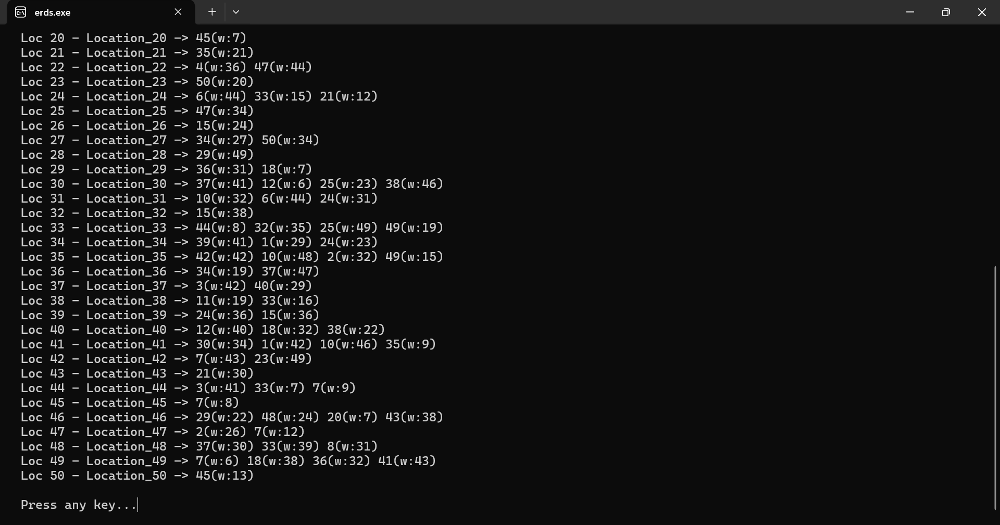
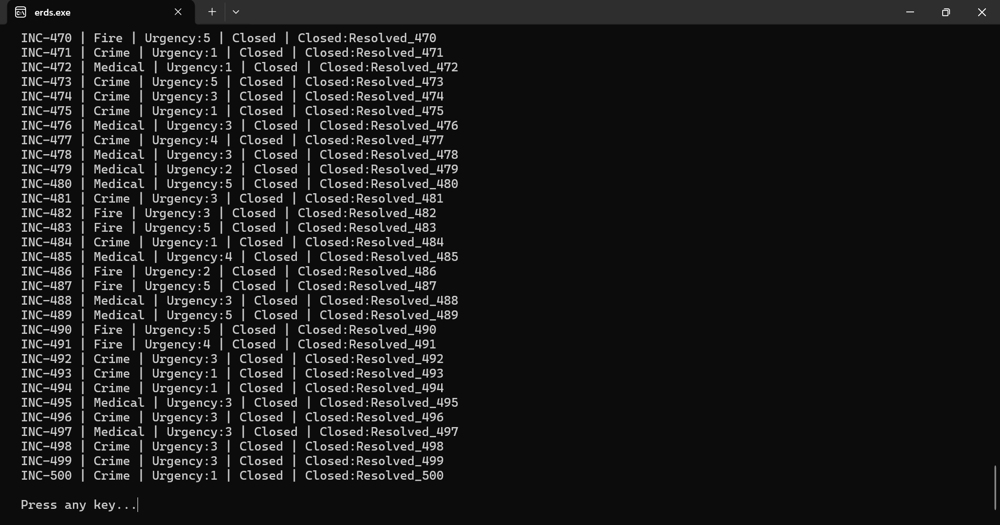

# Emergency Response Dispatch System 🚑 (Data Structures)

A C++ terminal-based application utilizing advanced Data Structures (Graphs, Hash Maps, Priority Queues, Tries) to manage and dispatch emergency vehicles (Ambulances, Firetrucks, Police) across a mapped city grid based on real-time incident reports.

## Features

- **City Graph & Routing:** Implements Dijkstra's Algorithm / A* to calculate the fastest route from available vehicles to the incident location.
- **Incident Prioritization:** Uses a Max-Heap / Priority Queue to handle severe emergencies (e.g., Fire vs. Minor Accident) first.
- **Vehicle Fleet Tracking:** Manages real-time availability and status of different emergency response units using Hash Maps.
- **Search System:** Trie-based auto-completion for fast lookup of streets, locations, and personnel.
- **Persistent Data:** Serializes state to `.dat` files to ensure data persistence across sessions.

## Screenshots

## Prerequisites

- C++ Compiler (GCC / MinGW)

## How to Run

1. Run `run.bat` to compile and launch the system.
2. Follow the terminal menu to simulate an incident, view the graph, or dispatch vehicles.
